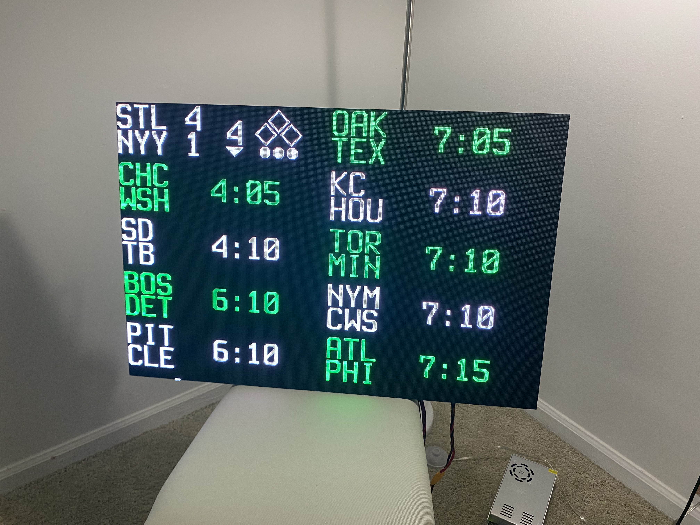
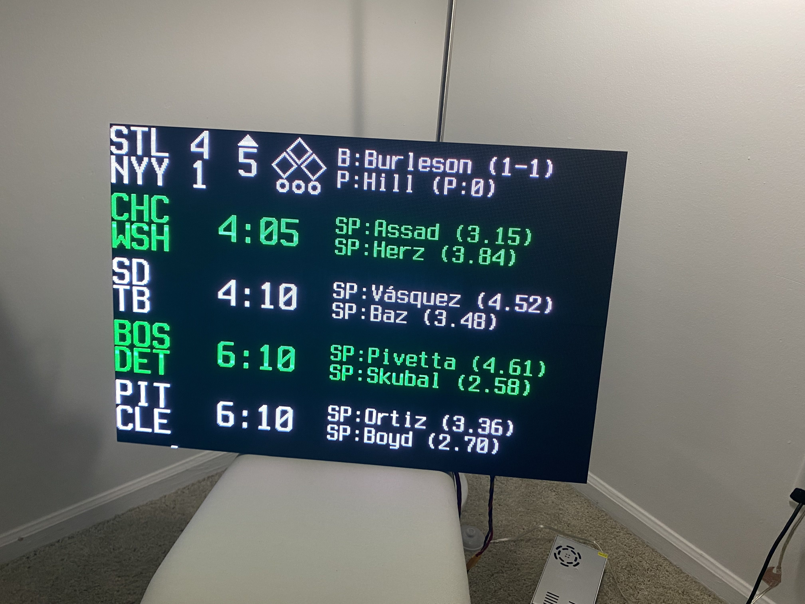
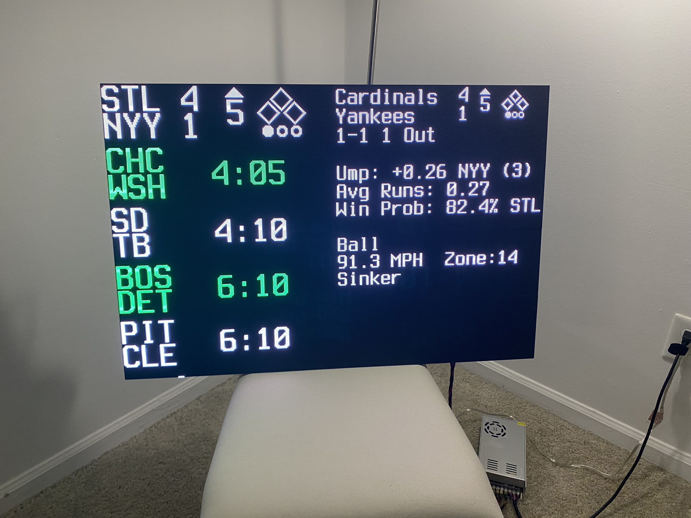

# onDeck Scoreboard
This project is a MLB scoreboard built using Hub75 matrix displays, controlled by a Raspberry Pi. The Pi uses [rpi-rgb-led-matrix](https://github.com/hzeller/rpi-rgb-led-matrix) as the backbone for controlling the displays. Data is sent via POST requests to the Pi with the endpoint indicating which game the data is for.

# Images/Examples

## Dual Columns


## Detailed View

- Pregame
    - Starting pitchers
    - Starting pitcher ERAs
- Live
    - Current batter
    - Current pitcher
    - Batter summary
    - Pitcher pitch count
- Final
    - Winning pitcher
    - Losing pitcher
    - Save pitcher (if applicable)



## Gamecast View
- Linescore
    - Live scores
    - Count + Outs
- State Analysis
    - Live umpire analysis (think [UmpScorecards](https://x.com/UmpScorecards))
    - Average number of runs scored from    current state
    - Probability of scoring (not shown)
    - Live win probabilities
- Pitch Analysis
    - Pitch result
    - Pitch speed
    - Zone number (ball or strike)
    - Pitch type
- Hit Details
    - Exit Velocity
    - Estimated Distance
    - Launch Angle



## JSON Game Template Example

``` json
    {
        'game_state': 'L', // 'P', 'L', 'F', 'D', 'P'
        'away_score': 5,
        'home_score': 3,
        'inning': 9,
        'inning_state': 'B', // 'T', 'B'
        'away': {
            'abv': 'AZ',
            'name': 'D-backs',
            'location': 'Arizona', // Not used currently
        },
        'home': {
            'abv': 'TEX',
            'name': 'Rangers',
            'location': 'Texas' , // Not used currently
        },
        'count': {
            'balls': 0,
            'strikes': 0,
            'outs': 0
        },
        'runners': 1, // 0-7. Represented in binary. b001 = runner on first. b010 = runner on second
        'start_time': '7:07',
        'matchup': {
            'batter': 'Seager',
            'batter_summary': '0-2',
            'pitcher': 'Sewald',
            'pitcher_summary': 'P:8'
        },
        'decisions': {
            'win': 'Leclerc',
            'win_summary': '1-1',
            'loss': 'Castro',
            'loss_summary': '0-1',
            'save': None,
            'save_summary': None
        },
        'probables': {
            'away': 'Gallen',
            'away_era': '5.24',
            'home': 'Eovaldi',
            'home_era': '2.42'
        },
        'pitch_details': {
            'description': 'In play, run(s)',
            'speed': 93.6,
            'type': 'Four-Seam Fastball',
            'zone': 1,
            'spin_rate': None, // Not used, inconsistant data from API
        },
        'hit_details': {
            'distance': 418,
            'exit_velo': 112.6,
            'launch_angle': 33.0
        },
        'umpire': {
            'num_missed': 11,
            'home_favor': 0.08,
            'home_wpa': -0.0565
        },
        'run_expectancy': {
            'average_runs': 0.540332,
            'to_score': 0.275
        },
        'win_probability':{
            'away': 0.887424,
            'home': 0.112576,
            'extras': 0.091616
        },
        'flags': {
            'no_hitter': False,
            'perfect_game': False // kinda unrelated but a perfect game is not a no hitter according to MLB API
        },
        'display_game': True // scoreboard will ignore if set to False. This value gets set to true when the server recieves data for the given game
    }
```

text